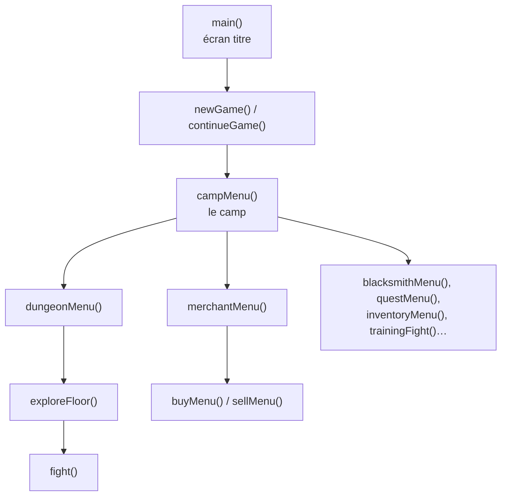

# DunGo — Comment marche le code

Ce document explique le code de DunGo à quelqu'un qui connaît les **bases de Go**. Quand une notion de Go est utilisée, un encadré **Rappel Go** la réexplique en quelques lignes.

**Lancer le jeu**, depuis le dossier du projet :

```bash
go run ./src
```

**Retrouver une fonction.** Chaque fonction a un commentaire sur sa ligne, qui commence par une étiquette de thème :

```go
func fight(character *Character, monster *Monster, training bool) string { // [COMBAT] sert à faire tout le combat, tour par tour, et renvoie comment il finit : Victory, Defeat ou Fled
```

Dans VS Code, **Ctrl+Maj+F** sur `[COMBAT]` liste toutes les fonctions du combat.

**Sommaire**

1. [Vue d'ensemble](#1-vue-densemble)
2. [Les données du jeu](#2-les-données-du-jeu)
3. [Le héros](#3-le-héros)
4. [Le combat](#4-le-combat)
5. [Le donjon](#5-le-donjon)
6. [Le camp](#6-le-camp)
7. [La sauvegarde](#7-la-sauvegarde)
8. [L'affichage et le clavier](#8-laffichage-et-le-clavier)
9. [Questions pièges](#9-questions-pièges)

## 1. Vue d'ensemble

### Les fichiers

> **Rappel Go :** tous les fichiers commencent par `package main`. Ils forment donc **un seul programme** : une fonction de `combat.go` peut appeler une fonction de `items.go` sans rien importer. Le programme démarre dans la fonction `main()`.

Le code est rangé en **un fichier par thème**, et chaque fichier a son étiquette :

| Fichier | Étiquette | Contenu |
|---|---|---|
| `main.go` | `[ACCUEIL]` | l'écran titre, nouvelle partie, continuer, prologue, crédits |
| `camp.go` | `[CAMP]` | le menu du camp, l'entraînement |
| `character.go` | `[HEROS]` | le héros, les classes, les difficultés, les niveaux, la mort |
| `items.go` | `[INVENTAIRE]` | les objets, les équipements, le sac |
| `merchant.go` | `[MARCHAND]` | acheter et vendre |
| `blacksmith.go` | `[FORGERON]` | fabriquer des armes et des armures |
| `quests.go` | `[MISSIONS]` | les missions |
| `dungeon.go` | `[DONJON]` | les étages et les salles |
| `sphinx.go` | `[SPHINX]` | les énigmes |
| `monster.go` | `[MONSTRES]` | la liste des monstres, et comment ils attaquent |
| `combat.go` | `[COMBAT]` | la boucle de combat, les dégâts |
| `spells.go` | `[SORTS]` | les sorts |
| `effects.go` | `[EFFETS]` | saignement, brûlure, étourdissement… |
| `save.go` | `[SAUVEGARDE]` | la sauvegarde |
| `display.go` | `[AFFICHAGE]` | couleurs, cadres, menus, jauges |
| `input.go` | `[SAISIE]` | lire le clavier |
| `art.go` | `[DESSINS]` | les dessins |

### Le jeu est une pile d'écrans

Chaque écran du jeu est une **fonction**. Aller dans un écran, c'est **appeler** sa fonction ; revenir en arrière, c'est **sortir** de la fonction (`return`).



Exemple : le camp appelle `merchantMenu`, qui appelle `buyMenu`. Le joueur tape `0` : `buyMenu` fait `return`, et on se retrouve dans `merchantMenu`. Il tape encore `0` : on revient au camp. Aucune variable ne retient « l'écran actuel » : c'est Go qui se souvient de quelle fonction a appelé laquelle.

### Le modèle d'un écran

Tous les menus sont écrits de la même façon (ici un peu raccourci) :

```go
func merchantMenu(character *Character) {
	for {
		clearScreen()              // 1. effacer
		banner("LE MARCHAND", Gold) // 2. afficher
		option(1, "Acheter")
		option(2, "Vendre")
		backOption("Retour au camp")

		switch readChoice(0, 2) {   // 3. lire un numéro, 4. agir
		case 0:
			return                  // on quitte l'écran
		case 1:
			buyMenu(character)      // on va dans un sous-écran, puis on revient ici
		case 2:
			sellMenu(character)
		}
	}
}
```

> **Rappel Go :** `for { … }` sans condition est une boucle infinie ; on en sort avec `return`. Dans un `switch`, chaque `case` s'arrête tout seul : pas besoin de `break` comme en C.

La boucle sert à **redessiner** l'écran après chaque action, par exemple pour afficher la bourse à jour après un achat.

### Où le jeu garde ses informations

- **Le héros** : une seule valeur `Character`, partagée par toutes les fonctions.
- **Le monstre du combat en cours** : créé au début du combat, oublié à la fin.
- **Le numéro de la salle** dans un étage : une simple variable de boucle dans `exploreFloor`.

Tout le reste (monstres, objets, sorts…) est rangé dans des tables qui ne changent jamais.

> **Rappel Go : les pointeurs.** Les fonctions reçoivent `character *Character`, c'est-à-dire l'**adresse** du héros, et pas une copie. Toutes les fonctions modifient donc **le même** héros : quand le marchand retire des Y-Coins, la fiche du héros les voit disparaître. Sans le `*`, chaque fonction travaillerait sur une copie, et ses changements seraient perdus.

## 2. Les données du jeu

Tout le **contenu** du jeu est rangé dans des **tables**. Le code ne fait que les parcourir. Pour ajouter un monstre, on ajoute une ligne ; pour changer le prix d'une potion, on change un nombre.

| Table | Fichier | Contient |
|---|---|---|
| `classes` | character.go | les 3 classes (Humain, Elfe, Nain) |
| `difficulties` | character.go | les 3 difficultés |
| `bestiary` | monster.go | les 11 monstres (dont 3 boss et le gobelin d'entraînement) |
| `spells` | spells.go | les 5 sorts |
| `items` | items.go | les 9 objets du marchand et leur prix |
| `gear` | items.go | les 12 armes et armures |
| `shopItems` | merchant.go | l'ordre d'affichage des objets du marchand |
| `shelves` | blacksmith.go | les recettes du forgeron |
| `quests` | quests.go | les 5 missions |
| `floors` | dungeon.go | les 3 étages |
| `riddles` | sphinx.go | les 6 énigmes du sphinx |

> **Rappel Go : slice et map.**
> - Une **slice** (`[]string`, `[]Floor`…) est une **liste ordonnée**. On lit un élément avec sa position, qui commence à **0** : `floors[0]` est l'étage 1. `len(floors)` donne la longueur, `append` ajoute à la fin.
> - Une **map** (`map[string]Item`…) associe une **clé** à une valeur, comme un dictionnaire : `items["Potion de vie"].Price` vaut 8.
>
> On prend une **slice** quand l'ordre compte (étages, missions), et une **map** quand on cherche par nom (objets, monstres, sorts).

Trois comportements des maps sont importants dans DunGo :

1. **Une clé absente donne zéro.** `character.Inventory["Peau de Troll"]` vaut `0` si le héros n'en a pas. Ce n'est pas une erreur, et le forgeron s'en sert pour compter les matériaux.
2. **Une map n'a pas d'ordre.** Parcourue avec `range`, elle donne ses éléments dans un ordre au hasard. C'est pour ça que `sortedInventory` trie le sac avant de l'afficher, et que `shopItems` fixe l'ordre des objets du marchand.
3. **On ne peut pas écrire dans une map vide (`nil`).** Ça fait planter le programme. C'est pour ça que le héros est créé avec `Inventory: map[string]int{…}`, et que `loadGame` recrée les maps si elles manquent.

**Les noms sont des constantes.** Le code écrit `ItemHealthPotion` et jamais le texte `"Potion de vie"`. Une faute de frappe dans une constante empêche le programme de compiler ; une faute dans un texte passerait inaperçue.

**Un monstre a une clé et un nom.** Sa clé (`"wolf"`) sert à le retrouver dans `bestiary`. Son nom (`"Loup des cavernes"`) est affiché au joueur, et c'est lui que les missions comparent.

## 3. Le héros

Tout se passe dans `character.go`.

### La structure Character

`Character` contient **tout** ce qui concerne le héros, et c'est la **seule** chose sauvegardée.

| Groupe | Champs |
|---|---|
| Identité | `Name`, `Class`, `Difficulty`, `SaveSlot` |
| Statistiques | `Level`, `XP`, `XPToLevelUp`, `HP`, `MaxHP`, `Mana`, `MaxMana`, `Attack`, `YCoins` |
| Possessions | `Spells` (les sorts connus), `Inventory` (le sac : nom → quantité), `InventoryMax`, `InventoryUpgrades`, `Equipment` (emplacement → objet porté), `FreePotionTaken` |
| Progression | `FloorsCleared` (étages terminés, de 0 à 3), `Victories`, `Deaths` |
| Mission | `QuestIndex`, `QuestActive`, `QuestProgress` |
| Effets de combat | `Bleeding`, `Burning`, `Stunned`, `Weakened`, `StoneSkin` |

> **Rappel Go : struct.** Une `struct` regroupe plusieurs valeurs sous un seul nom. On lit un champ avec un point : `character.HP`. Un champ jamais rempli vaut sa **valeur zéro** : `0` pour un nombre, `""` pour un texte, `false` pour un booléen.

### La création

`createCharacter` demande le nom, puis la classe (`chooseClass`), puis la difficulté (`chooseDifficulty`).

- **Le nom** doit faire de 1 à 12 lettres, sans chiffre ni espace (`isValidName`). Les accents sont acceptés. `formatName` met une majuscule au début : « pACO » → « Paco ».
- **Le héros de départ** (`startingCharacter`) : niveau 1, **la moitié** de ses PV max, tout son mana, 5 d'attaque, 50 Y-Coins, une Potion de vie, un sac de 10 places, le sort Coup de poing et le sort de sa classe.

| Classe | PV | Mana | Sort de classe | Gain par niveau |
|---|---|---|---|---|
| Humain | 100 | 40 | Second Souffle (soin) | +10 PV, +5 mana |
| Elfe | 80 | 60 | Flèche d'Argent (13 dégâts) | +6 PV, +8 mana |
| Nain | 120 | 30 | Peau de Pierre (protection) | +12 PV, +3 mana |

### La difficulté

Une difficulté, ce sont juste deux pourcentages, appliqués à chaque monstre au moment où il est créé (`newMonster`) :

| Difficulté | PV et attaque des monstres | XP et Y-Coins gagnés |
|---|---|---|
| Facile | 75 % | 100 % |
| Normal | 100 % | 100 % |
| Difficile | 130 % | 150 % |

> **Rappel Go : la division entière.** Entre deux `int`, la division **coupe les décimales** : `7 / 2` vaut `3`. C'est pour ça qu'on multiplie d'abord et qu'on divise ensuite : `monster.MaxHP * 75 / 100`. En Facile, un gobelin à 5 d'attaque tombe à 5 × 75 / 100 = 3,75, coupé à **3**.

### Les niveaux

Le cœur de `gainXP` :

```go
character.XP += amount
for character.XP >= character.XPToLevelUp {
	character.XP -= character.XPToLevelUp                    // l'XP en trop est gardée
	character.XPToLevelUp = character.XPToLevelUp * 3 / 2    // palier suivant × 1,5
	character.Level++
}
```

C'est un `for` et pas un `if` : un gros gain d'XP peut faire monter de **plusieurs niveaux** d'un coup. Les paliers sont 50, 75, 112, 168, 252… À chaque niveau : les PV et le mana de la classe, +1 d'attaque, puis PV et mana remis au maximum.

### La mort

`characterDies` est appelée quand les PV tombent à 0 (en combat, ou en buvant la Potion de poison). Le héros perd 20 % de ses Y-Coins (`YCoins / 5`) et ressuscite au camp avec la moitié de ses PV. La partie ne s'arrête jamais.

## 4. Le combat

Le combat est dans `combat.go`, avec l'aide de `monster.go` (les attaques des monstres), `spells.go` (les sorts) et `effects.go` (les effets).

### La boucle de combat

Voici la fonction `fight`, sans les lignes d'affichage :

```go
func fight(character *Character, monster *Monster, training bool) string {
	clearEffects(character)
	for turn := 1; ; turn++ {
		showFightScreen(character, monster, turn)

		// 1. Le héros joue
		fled := characterTurn(character, monster, training)
		if fled {
			return Fled
		}
		// 2. Le monstre riposte, s'il est encore debout
		if monster.HP > 0 {
			monsterTurn(monster, character, turn)
		}
		// 3. Saignement et brûlure, si les deux sont encore debout
		if monster.HP > 0 && character.HP > 0 {
			endOfTurnEffects(character, monster)
		}
		// 4. Quelqu'un est tombé ? On regarde le héros en premier
		if character.HP <= 0 {
			return loseFight(character, training)
		}
		if monster.HP <= 0 {
			return winFight(character, monster, training)
		}
	}
}
```

> **Rappel Go :** `for turn := 1; ; turn++` n'a pas de condition au milieu : la boucle tourne jusqu'à un `return`. La fonction renvoie une des trois constantes `Victory`, `Defeat` ou `Fled`.

À retenir :

- Le héros joue **toujours en premier**. S'il tue le monstre, le monstre ne riposte pas.
- On regarde le héros **avant** le monstre : si les deux tombent en même temps (à cause des effets), c'est une **défaite**. Le héros ne gagne jamais avec 0 PV.

### Le tour du héros

`characterTurn` propose 4 choix : **Attaquer**, **Sorts**, **Objets**, **Fuir**. S'il est étourdi, le héros passe son tour sans choisir.

Le menu revient tant que le héros n'a pas **vraiment** joué. Faire « Retour » dans les sorts, manquer de mana, essayer de fuir un boss ou boire une potion alors que les PV sont au maximum **ne coûte pas le tour**.

La fuite (`tryToFlee`) réussit une fois sur deux. Si elle rate, le tour est perdu.

> **Rappel Go : le hasard.** `rand.IntN(100)` donne un nombre au hasard entre 0 et 99. `rand.IntN(100) < 50` est donc vrai 50 fois sur 100. Même idée pour le coup critique (`< 10`) et le sphinx (`< 15`).

### Les dégâts

| Fonction | Qui frappe | Règles |
|---|---|---|
| `characterHitsMonster` | le héros (attaque ou sort) | affaibli : ÷ 2 ; puis 10 % de chance de critique : × 2 |
| `removeMonsterHP` | poison, brûlure | aucun bonus |
| `monsterHitsCharacter` | le monstre | Peau de Pierre : ÷ 2 |

Les PV ne descendent jamais sous 0 : `monster.HP = max(monster.HP-damage, 0)`.

> **Piège :** l'affaiblissement est appliqué **avant** le critique. Avec 5 d'attaque, affaibli et critique : 5 ÷ 2 = 2, puis × 2 = 4 (et pas 5).

### Les sorts

| Sort | Mana | Effet | Qui l'a |
|---|---|---|---|
| Coup de poing | 5 | 8 dégâts | tout le monde |
| Flèche d'Argent | 8 | 13 dégâts | l'Elfe |
| Second Souffle | 10 | +25 PV, soigne saignement et brûlure | l'Humain |
| Peau de Pierre | 8 | les 2 prochains coups reçus ÷ 2 | le Nain |
| Boule de Feu | 15 | 18 dégâts, et le monstre brûle 3 tours | avec le Livre de Sort |

`castSpell` fait trois choses : retirer le mana, appliquer les dégâts (avec `characterHitsMonster`), puis l'effet spécial du sort avec un `switch` sur son nom.

### Les monstres

`newMonster` fabrique le monstre d'un combat :

```go
monster := bestiary[key]   // une COPIE de la ligne du bestiaire
monster.MaxHP = monster.MaxHP * difficulty.MonsterPercent / 100
monster.HP = monster.MaxHP // pleine vie
return &monster            // l'adresse de la copie
```

Lire une struct dans une map donne une **copie**. Le combat blesse la copie, jamais le bestiaire : le monstre suivant repart à pleine vie.

`monsterTurn` choisit comment le monstre attaque, avec un `switch` sur sa clé : les trois boss ont leur propre fonction, et tous les autres utilisent `normalMonsterTurn`. Tous suivent le même rythme : une attaque normale aux tours 1 et 2, une **attaque spéciale au tour 3** (puis 6, 9…).

| Monstre | Attaque spéciale (tours 3, 6, 9…) |
|---|---|
| Monstres ordinaires | attaque × 2, puis leur effet (loup : saignement, squelette : affaiblissement, troll : étourdissement, Krokmou : brûlure) |
| Grukk (étage 1) | un garde le soigne de 20 PV, puis il frappe × 1,5 |
| Mor'Vath (étage 2) | vole jusqu'à 15 mana, se soigne du double, frappe et affaiblit |
| Ignarok (étage 3) | Souffle Infernal : × 2,5 et brûlure. Sous la moitié de ses PV, il enrage **une fois** : +30 % d'attaque |

> **Rappel Go : le modulo.** `%` donne le reste d'une division : `turn % 3 == 0` est vrai aux tours 3, 6, 9…

### Les effets

Un effet n'est qu'un **compteur** dans le héros : le nombre de tours (ou de coups) qu'il lui reste. `inflictEffect` le met en place, il baisse de 1 à chaque utilisation, et à 0 l'effet est fini.

| Effet | Ce qu'il fait | Durée |
|---|---|---|
| Saignement | -3 PV à la fin de chaque tour | 3 tours |
| Brûlure | -5 PV à la fin de chaque tour | 3 tours |
| Étourdissement | le héros passe son tour | 1 tour |
| Affaiblissement | les coups du héros ÷ 2 | 3 coups portés |
| Peau de Pierre | les coups reçus ÷ 2 | 2 coups reçus |

Tous les effets du héros sont remis à 0 **au début** de chaque combat (`clearEffects`).

### La fin du combat

- **Victoire** (`winFight`) : les Y-Coins du monstre, peut-être un objet (avec `DropChance` % de chance ; perdu si le sac est plein), l'XP, puis la mission avance (`updateQuest`).
- **Défaite** (`loseFight`) : la mort du héros (`characterDies`).
- **L'entraînement** (`trainingFight`) : un vrai combat contre un gobelin, mais sans butin, sans mort et sans objets. Le héros récupère ses PV et son mana à la fin.

### Exemple : un combat contre un loup

Un Elfe (80 PV, 60 mana, 5 d'attaque) affronte un Loup des cavernes en Normal (28 PV, 6 d'attaque). Aucun critique.

| Tour | Le héros | Le loup | Fin du tour | PV héros / loup |
|---|---|---|---|---|
| 1 | Flèche d'Argent : 13 dégâts (mana 52) | attaque : 6 | — | 74 / 15 |
| 2 | attaque : 5 | attaque : 6 | — | 68 / 10 |
| 3 | attaque : 5 | **attaque puissante** : 12, et saignement | saignement : -3 | 53 / 5 |
| 4 | attaque : 5 → le loup tombe | ne joue pas | pas d'effets | 53 / 0 |

Victoire : +3 Y-Coins, 75 % de chances d'obtenir une Fourrure de Loup, +18 XP.

## 5. Le donjon

| Étage | Salles | Monstres | Boss |
|---|---|---|---|
| 1 · Les Galeries Gobelines | 5 | gobelin, loup, corbeau, sanglier | Grukk |
| 2 · Les Cryptes Englouties | 6 | squelette, troll, sanglier, corbeau | Mor'Vath |
| 3 · L'Antre d'Ignarok | 5 | Krokmou, troll, squelette | Ignarok |

**Les étages verrouillés.** Un seul nombre suffit : `FloorsCleared`, le nombre d'étages terminés. Avec `FloorsCleared = 1`, l'étage 1 est terminé, l'étage 2 est ouvert, l'étage 3 est verrouillé. On peut toujours rejouer un étage terminé.

**L'exploration d'un étage** (`exploreFloor`) :

```go
for room := 1; room <= floor.Rooms; room++ {
	isBossRoom := room == floor.Rooms   // la dernière salle est celle du boss

	sphinxSolved := false
	if !isBossRoom && rand.IntN(100) < 15 {
		sphinxSolved = sphinxRiddle(character, floor, floorIndex)
	}
	if !sphinxSolved {
		won := roomFight(character, floor, room)   // un monstre au hasard, ou le boss
		if !won {
			return   // fuite ou mort : retour au camp
		}
	}
	if !isBossRoom {
		goOn := askNextRoom(character, floor, room)  // continuer ou remonter ?
		if !goOn {
			return
		}
	}
}
```

- **Le sphinx** apparaît dans 15 % des salles ordinaires. Bonne réponse : 15 Y-Coins et 10 XP par numéro d'étage, et pas de combat. Mauvaise réponse : le monstre attaque quand même.
- **Remonter au camp, fuir ou mourir** fait recommencer l'étage à la salle 1 : le numéro de salle n'est qu'une variable de la boucle, il n'est pas sauvegardé.
- **Battre le boss** débloque l'étage suivant (la première fois seulement). Battre Ignarok affiche l'écran de victoire, puis la partie continue.

## 6. Le camp

`campMenu` est la boucle principale d'une partie : on y revient toujours. Il mène au donjon, au marchand, au forgeron, aux missions, à l'entraînement, à l'inventaire, à la fiche du héros et à la sauvegarde.

### Le marchand (merchant.go)

- La **première Potion de vie est gratuite** (`FreePotionTaken`).
- On ne paie que s'il y a de la place dans le sac.
- L'**Augmentation d'inventaire** (75 Y-Coins) agrandit le sac de 10 places, 3 fois au maximum.
- **Revendre** : un objet rapporte la moitié de son prix ; un équipement rapporte ses PV bonus + 4 × son attaque bonus.

| Objet | Prix | Effet |
|---|---|---|
| Potion de vie | 8 | +50 PV |
| Potion de mana | 10 | +30 mana |
| Potion de poison | 15 | 30 dégâts au monstre en combat… ou au héros s'il la boit au camp |
| Livre de Sort : Boule de Feu | 60 | apprend Boule de Feu |
| Fourrure, Peau de Troll, Cuir, Plume | 10, 18, 8, 3 | ressources pour le forgeron |
| Augmentation d'inventaire | 75 | +10 places dans le sac |

### L'inventaire et l'équipement (items.go)

Le sac est une map « nom de l'objet → quantité ». `useItem` utilise un objet et renvoie `true` s'il a servi (il est alors retiré du sac). Une potion est refusée si les PV (ou le mana) sont déjà au maximum.

**Équiper** (`equipItem`) : on retire l'objet déjà porté au même endroit (et ses bonus), on le remet dans le sac, puis on porte le nouveau et on ajoute ses bonus. Il y a 4 emplacements : Tête, Torse, Pieds, Arme. Les armures donnent des PV max, les armes de l'attaque. Une arme faite **pour sa classe** donne **+2 d'attaque** en plus (`attackBonus`).

### Le forgeron (blacksmith.go)

Une recette = un objet, un prix en Y-Coins, et des matériaux (fourrures, peaux, cuirs, plumes, laissés par les monstres). `canCraft` vérifie qu'on a tout ; `craft` retire les matériaux et les Y-Coins, puis range l'objet dans le sac. Il faut ensuite l'équiper depuis l'inventaire.

### Les missions (quests.go)

5 missions, **une à la fois, dans l'ordre** (« vaincre 3 gobelins »…). Trois champs du héros suffisent :

- `QuestIndex` : quelle mission ;
- `QuestActive` : acceptée ou pas ;
- `QuestProgress` : combien de monstres cibles vaincus.

Après chaque victoire, `updateQuest` compare le **nom** du monstre à la cible de la mission. Les monstres vaincus avant d'accepter la mission ne comptent pas.

## 7. La sauvegarde

Une sauvegarde est le `Character` écrit dans un fichier texte au format **JSON** : `dungo_save_1.json`, `dungo_save_2.json` ou `dungo_save_3.json`.

```go
data, err := json.MarshalIndent(character, "", "  ")  // le héros → texte JSON
err = os.WriteFile(saveFileName(character.SaveSlot), data, 0644)  // le texte → fichier
```

Pour charger, `loadGame` fait l'inverse : `os.ReadFile`, puis `json.Unmarshal`.

> **Rappel Go : les erreurs.** Une fonction qui peut échouer renvoie une erreur en plus de son résultat. On la teste juste après : `if err != nil { … }`. `nil` veut dire « pas d'erreur ».

> **Rappel Go : la majuscule.** Tous les champs de `Character` commencent par une majuscule, sinon `encoding/json` ne les verrait pas : un nom en minuscule reste privé à son paquet. Un champ en minuscule ne serait donc **pas sauvegardé**, sans aucun message d'erreur.

À savoir :

- On ne sauvegarde qu'au camp : il n'y a pas de sauvegarde automatique.
- Les fichiers sont écrits dans le dossier **depuis lequel on lance le jeu**.
- Un fichier abîmé s'affiche « Sauvegarde illisible » au lieu de faire planter le jeu.

## 8. L'affichage et le clavier

**Les couleurs** sont des **codes ANSI** : de petits textes que le terminal exécute au lieu de les afficher. `Red = "\033[38;5;196m"` veut dire « écris avec la couleur n° 196 ». Toute couleur doit être refermée par `Reset`, sinon elle déborde sur la suite.

**Les dessins** (art.go) sont en caractères braille : chaque caractère contient 2 × 4 points, ce qui permet des dessins bien plus fins qu'avec des lettres. `printArt(dessin, couleurs...)` les colore en dégradé du haut vers le bas.

> **Rappel Go :** `couleurs ...string` veut dire « autant de couleurs qu'on veut ». Pour passer une slice existante, on écrit `printArt(monster.Art, monster.ArtColors...)`.

**Les jauges** (`bar`) remplissent `current * width / maximum` cases avec `█`, le reste avec `░`. La jauge de PV devient jaune sous 60 %, puis rouge sous 30 %.

**Le clavier.** Toute la saisie passe par `readChoice(low, high)` :

```go
for {
	number, err := strconv.Atoi(readLine())   // "3" → 3 ; "abc" → erreur
	if err == nil && number >= low && number <= high {
		return number
	}
	fail("Tapez un nombre entre %d et %d.", low, high)
}
```

Taper n'importe quoi (des lettres, rien, un nombre trop grand) ne peut pas faire planter le jeu : la boucle redemande.

## 9. Questions pièges

| Question | Réponse |
|---|---|
| Pourquoi `*Character` partout ? | Pour que toutes les fonctions modifient **le même** héros, et pas une copie. |
| Un monstre blessé reste-t-il blessé au combat suivant ? | Non : `newMonster` part d'une **copie** du bestiaire, à pleine vie. |
| Pourquoi trier le sac ? | Une map n'a pas d'ordre : sans tri, les objets changeraient de place à chaque affichage. |
| Slice ou map ? | Slice quand l'ordre compte (étages, missions), map quand on cherche par nom (objets, monstres). |
| Que se passe-t-il si on tape une lettre ? | `strconv.Atoi` échoue et `readChoice` redemande. Le jeu ne plante jamais. |
| Comment chaque boss a-t-il son pouvoir ? | `monsterTurn` fait un `switch` sur la clé du monstre ; chaque boss a sa fonction. |
| Pourquoi les champs de `Character` ont une majuscule ? | Pour que `encoding/json` puisse les lire et les écrire. |
| Et si le héros et le monstre tombent en même temps ? | Défaite : `fight` regarde le héros en premier. |
| Pourquoi `7 / 2` donne 3 ? | Division entière : les décimales sont coupées. On multiplie donc avant de diviser. |
| Comment marche le hasard ? | `rand.IntN(100) < p` est vrai p fois sur 100. |
| Pourquoi recommence-t-on l'étage après être remonté ? | Le numéro de salle n'est qu'une variable de boucle, il n'est pas sauvegardé. |
| Peut-on fuir un boss ? | Pas pendant le combat. Mais on peut repartir avant de l'affronter. |
| Les monstres tués avant d'accepter une mission comptent-ils ? | Non. `updateQuest` ne fait rien tant que la mission n'est pas acceptée. |
| Peut-on tricher ? | Oui, en modifiant le fichier JSON à la main. C'est un jeu solo. |
| Où sont les sauvegardes ? | Dans le dossier depuis lequel on lance le jeu. |
| Comment ajouter un monstre ? | Une ligne dans `bestiary`, puis sa clé dans la liste des monstres d'un étage. |
| Pourquoi Go ? | Un langage simple, un seul exécutable, et une bibliothèque standard qui suffit : aucune dépendance à installer. |
